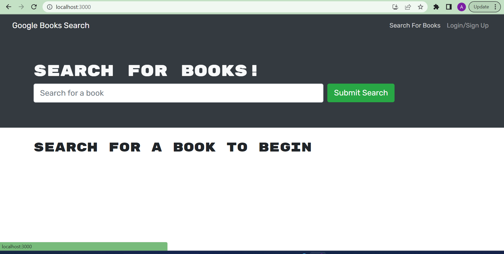
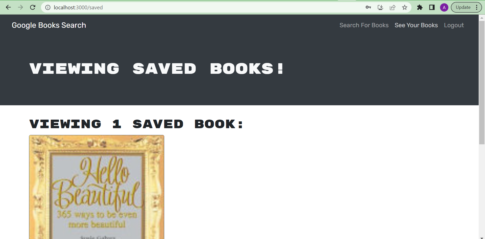
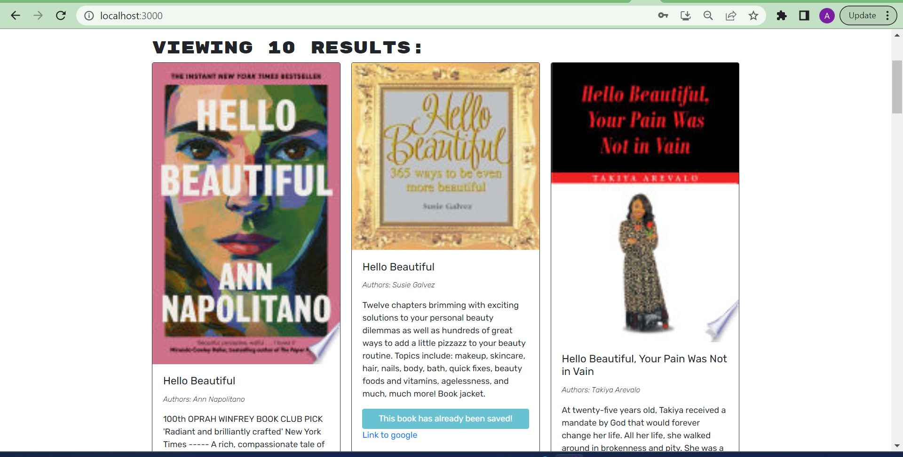

## Google Books App

- The Google Books App is a web application that allows users to search for books using the Google Books API and save their favorite books to a personal library. It provides a simple and intuitive interface for discovering, exploring, and managing book collections.

## Usage

- Enter a search query in the search bar to search for books.
- To save a book to your library, click the "Save" button on the book detail page.
- Access your saved books by clicking on the "Library" link in the navigation.
- To remove a book from your library, click the "Remove" button on the library page.

## Screenshots

## links

- [deployed link](https://google-books-app.herokuapp.com/) 

- [github link](https://github.com/Karbuuno/google-books-app)

License
The Google Books App is open source and released under the MIT License.
